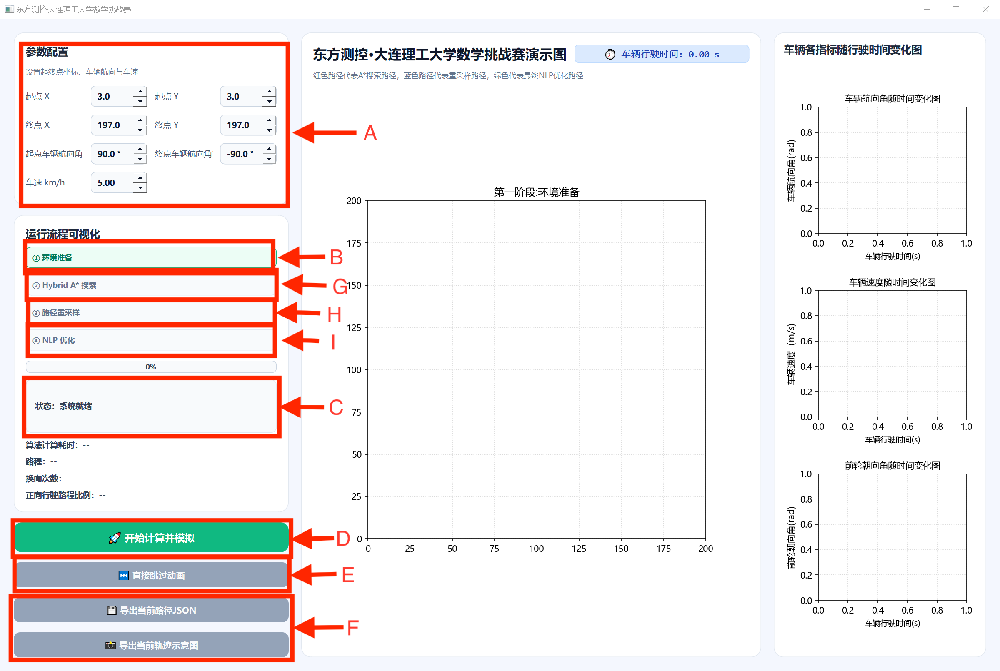

矿车路径规划系统 By Yusong Dong , Keyan Li , Juan Fan
## 一、 运行环境与依赖 (Environment & Dependencies)

### 1.1 基础运行环境
- **操作系统:** Windows 10 / Windows 11 (64位)
- **编程语言:** Python 3.9+ (推荐使用 3.10)
- **GUI 框架:** PySide6 (Qt for Python)

### 1.2 核心第三方库清单
本项目算法链路高度依赖以下科学计算与工程库：
- **numpy**: 处理底层矩阵运算与路径点数据。
- **casadi**: 核心非线性规划 (NLP) 求解器，用于处理车辆动力学约束下的轨迹平滑优化。
- **matplotlib**: 负责主界面的路径推演、实时动画及右侧参数状态曲线绘制。
- **shapely**: 用于处理多边形障碍物的几何拓扑关系与实时碰撞检测。
- **sympy**: 用于车辆运动学模型中复杂的数学公式符号化推导。

---

## 二、 安装与编译指南 (Installation & Build)

### 2.1 源码环境配置与运行
1. **解压源码**: 将本项目压缩包解压至不含中文字符的路径。
2. **激活环境**: 建议在虚拟环境（如 `.venv`）中操作。
3. **一键安装依赖**: 在项目根目录下打开终端，执行以下命令：
   ```bash
   pip install -r requirements.txt
4. **启动程序**: 在终端输入以下命令启动 GUI 界面:
   ```bash
   python appmain.py

### 2.2 可执行程序 (独立运行方式)
本交付物已提供预编译的独立运行版本，评委无需安装 Python 即可直接测试：
1. 进入项目根目录下的 bin/appmain3/ 文件夹。
2. 找到并双击运行 appmain3.exe。
重要提示: 若程序启动提示 DLL 加载失败，请确保已按照说明将本地 .venv 中的 casadi 文件夹完整复制到打包目录下的 _internal/ 路径内。

---

## 三、 运行与使用说明 (Usage Guide)

### 3.1 软件操作步骤

1. **参数配置**: 在界面左侧面板设置起点 X/Y、终点 X/Y、初始航向角及终止航向角（角度制）、车速（km/h),软件默认为题目中提供的初始值，如果有其他要求，可以自行设置。
2. **环境预览**: 修改参数后，点击“① 环境准备”按钮。中间主图将同步刷新障碍物分布、起终点位置及矿车初始朝向，可做预览。
3. **算法计算**: 当状态栏显示系统就绪时，点击绿色的“🚀 开始计算并模拟”按钮。系统将自动按序执行 Hybrid A* 搜索、路径重采样及 NLP 优化,在路径计算完成后，车辆会从起点沿规划路径逐步驶向终点，同时右侧车辆各指标随行驶时间变化图会同步进行，如果想提前结束动画，可以点击“直接跳过动画"按钮。
4. **


### 3.2 结果输出与解读
1. **可视化推演**: 中间视图会实时播放矿车沿绿色的最终优化路径行驶的动画。
2. **状态曲线**: 右侧三个图表会实时同步展示车辆航向角、速度、前轮转角随运行时间的变化，验证轨迹的平滑性与合规性。
3. **数据导出**: 点击“导出 JSON”按钮，系统将按赛方要求的 [x, y, yaw, direction] 格式导出 0.2m 间距的离散轨迹点。

---

## 四、 目录结构说明 (Directory Structure)
/ (项目根目录)
├── src/                      # 核心算法与 GUI 逻辑源代码
│   ├── appmain3.py           # 程序主入口 (界面与逻辑串联)
│   ├── config.py             # 车辆动力学与环境参数配置文件
│   ├── impro_hybrid_astar.py # 改进型混合 A* 算法实现
│   ├── nlp_opt.py            # 基于 CasADi 的非线性优化求解器
│   ├── resample.py           # 路径曲线插值与重采样模块
│   └── plot_vehicle.py       # 车辆几何模型绘制辅助模块
├── docs/                     # 竞赛相关文档
│   ├── 计算方法与算法说明书.pdf  # 理论基础与公式推导
│   └── README.md             # 本软件部署与使用说明书
├── bin/                      # 可执行程序发布目录
│   └── appmain3/             # 打包后的独立运行文件夹包
├── data/                     # 数据输入输出与缓存
│   ├── costmap_cache_0.5.npz # 预生成的代价地图缓存
│   └── 轨迹点结果.json        # 算法输出的标准 JSON 示例
├── requirements.txt          # 项目运行所需的 Python 依赖清单
├── app_logo.ico              # 软件窗口图标资源
└── README.md                 # (本文件) 项目说明指南
