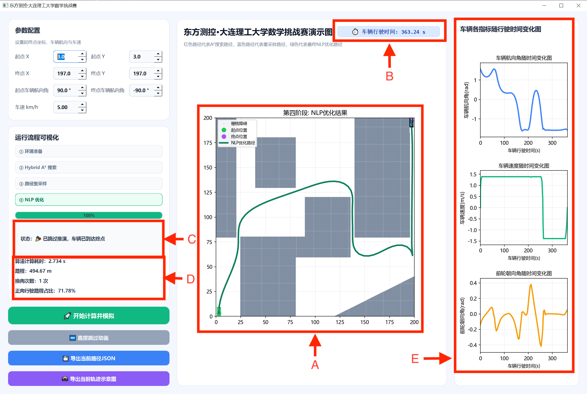
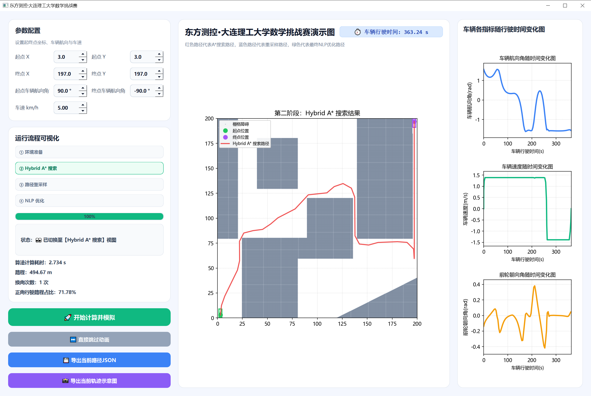

# 东方测控·大连理工大学数学挑战赛 - 矿车路径规划系统

## 一、 运行环境与依赖 (Environment & Dependencies)

### 1.1 基础运行环境
- **操作系统:** Windows 10 / Windows 11 (64位)
- **编程语言:** Python 3.9+ (推荐使用 3.10)
- **GUI 框架:** PySide6 (Qt for Python)

### 1.2 核心第三方库清单
本项目算法链路高度依赖以下科学计算与工程库：
- **numpy**: 处理底层矩阵运算与路径点数据。
- **casadi**: 核心非线性规划 (NLP) 求解器，用于处理车辆动力学约束下的轨迹平滑优化。
- **matplotlib**: 负责主界面的路径推演、实时动画及右侧参数状态曲线绘制。
- **shapely**: 用于处理多边形障碍物的几何拓扑关系与实时碰撞检测。
- **sympy**: 用于车辆运动学模型中复杂的数学公式符号化推导。

---

## 二、 安装与编译指南 (Installation & Build)

### 2.1 源码环境配置与运行
1. **解压源码**: 将本项目压缩包解压至不含中文字符的路径。
2. **激活环境**: 建议在虚拟环境（如 `.venv`）中操作。
3. **一键安装依赖**: 在项目根目录下打开终端，执行以下命令：
   ```bash
   pip install -r requirements.txt
4. **启动程序**: 在终端输入以下命令启动 GUI 界面:
   ```bash
   python appmain.py
5. **错误排查**：若按照上述步骤安装后，仍有类似
   ```bash
   
   ImportError: DLL load failed while importing QtCore: 找不到指定的程序。
报错，则可按照如下步骤解决：打开浏览器，搜索并下载 “微软常用运行库合集”，或者直接去微软官网下载最新的 Visual Studio 2015, 2017, 2019, and 2022 Redistributable（通常下载 vc_redist.x64.exe）。 安装该运行库，安装完成后重启电脑。
再次运行此代码。


### 2.2 可执行程序 
本交付物已提供预编译的独立运行版本，评委无需安装 Python 即可直接测试：
1. 进入项目根目录下的东方测控路径规划问题源代码最终版全\东方测控路径规划问题源代码final\dist\appmain\appmain.exe"。
2. 找到并双击运行 appmain.exe。
3. 若出现dll损失等错误，将本地的casadi文件覆盖到可执行文件中的casadi文件即可
---

## 三、 运行与使用说明 (Usage Guide)

### 3.1 软件操作步骤
<figure>
  
  <figcaption align="center">图 1 软件示意图</figcaption>
</figure>

1. **参数配置**: 见**图1A框所示**参数配置区域设置起点 X/Y、终点 X/Y、初始航向角及终止航向角（角度制）、车速（km/h），软件默认为题目中提供的初始值，如果有其他要求，可以自行设置。
2. **环境预览**: 修改参数后，点击**图1中B框位置**“① 环境准备”按钮。中间主图将同步刷新障碍物分布、起终点位置及矿车初始朝向，可做预览。
3. **算法计算**: 当**图1C框**状态栏显示系统就绪时，点击**图1D框**绿色的“🚀 开始计算并模拟”按钮。系统将自动按序执行 Hybrid A* 搜索、路径重采样及 NLP 优化,在路径计算完成后，车辆会从起点沿规划路径逐步驶向终点，同时右侧车辆各指标随行驶时间变化图会同步进行，如果想提前结束动画，可以点击**图1E框**“直接跳过动画"按钮。
4. **数据导出**：优化完成后，如果需要导出当前路径的坐标json文件或车辆行驶轨迹示意图，可点击**图1F框**
“导出当前路径JSON”按钮与“导出当前轨迹示意图”按钮。系统将按要求的 [x, y, yaw，direction]格式导出 0.2m 间距的离散轨迹点，以及当前的车辆行驶轨迹示意图
5. **规划过程查询**：优化完成后，如果需要查询规划过程中，A*搜索路径、重采样路径、NLP优化路径，点击流程可视化中对应框即**图1G框**、**图1H框**、**图1I框**

### 3.2 结果输出与解读
<figure>
  
  <figcaption align="center">图 2 软件结果图</figcaption>
</figure>
<figure>
  
  <figcaption align="center">图 3 A*搜索结果图</figcaption>
</figure>
<figure>
  
  <figcaption align="center">图 4 重采样结果图</figcaption>
</figure>

1.  **可视化推演** : **图2A框**实时播放矿车沿绿色的最终优化路径行驶的动画，推演完成后将显示NLP优化轨迹，**图2B框**将同步展示当前车辆物理行驶时间。算法计算推导过程中，**图2C框**将实时显现当前计算流程，及软件运行状态。
2. **指标展示**: 优化完成后**图2D框**会显示当前路径对应的算法计算耗时、路程、车辆换向次数、车辆正向行驶路程占比，**图2E框**会实时同步展示车辆航向角、速度、前轮转角随运行时间的变化，验证轨迹的平滑性与合规性。
3. **路径查看**: 按上一节操作步骤第五步及进行规划过程查询，将分别弹出如**图3**、**图4**、**图1**的界面，其对应中间主图分别显示对应的路径。


---

## 四、目录结构说明（Directory Structure）

```text
.
├── 东方测控路径规划问题源代码final/ 
│     ├── appmain.py              # 软件主程序入口
│     ├── main.py                 # 程序调试入口
│     ├── config.py               # 参数配置文件
│     ├── costmap.py              # 障碍物地图与约束地图生成模块
│     ├── impro_hybrid_astar.py   # 改进型 Hybrid A* 路径搜索算法
│     ├── nlp_opt.py              # 非线性优化模块
│     ├── resample.py             # 路径插值与重采样模块
│     ├── plot_vehicle.py         # 车辆模型绘制模块
│     ├── tunnels.py              # 隧道环境建模模块
│     ├── requirements.txt        # Python 依赖库列表
│     ├── appmain.spec            # 软件打包配置文件
│     ├── app_logo.ico            # 软件图标文件
│     ├── CurvesGenerator/        # 曲线生成相关模块
│     ├── build/                  # 打包过程生成的临时文件
│     └── dist/                   # 打包生成的可执行程序  
│       ├── appmain.exe      # 软件启动程序，双击即可运行
│       └── _internal/       # 程序运行所需的依赖库和资源文件# 核心源代码文件夹
├── 可执行文件/                           # 打包好的程序，方便非开发环境下运行
│   ├── _internal/                       # 运行依赖库
│   ├── costmap_cache_0.5.npz            # 成本图缓存文件
│   └── 东方测控大连理工大学数学挑战赛程序.exe # Windows 可执行程序
├── 计算方法及算法说明文档/               # 项目理论支撑文档
│   ├── 算法说明书.docx                   # 详细的算法逻辑描述
│   └── 计算方法.docx                     # 数学模型与计算步骤
├── 软件GUI示意图.png                     # 界面截图 1
├── 软件GUI示意图2.png                    # 界面截图 2
├── 软件GUI示意图3.png                    # 界面截图 3
├── 软件GUI示意图4.png                    # 界面截图 4
├── 矿车轨迹示意图.png                     # 矿车轨迹示意图
├── 矿车轨迹路径.json                     # 导出的轨迹数据文件
├── main.py                              # 程序启动主入口
└── read_me.md                           # 本说明文件

/（项目根目录）           

```